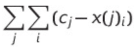

# Reading
Section 1 and 2 in 
https://robjhyndman.com/papers/DMKD.pdf

# Homework
Reproduce the lab and turn it in. 

What I want to see:

1. A plot of each of the N clusters you cluster your data in for the population data showing the cluster members and the cluster centers (_with captions describing the design of the plot and you see and what is interesting!_). You can use whatever method for clustering here: [k-means](https://scikit-learn.org/stable/modules/generated/sklearn.cluster.KMeans.html), [hierarchical clustering](https://scikit-learn.org/stable/modules/generated/sklearn.cluster.AgglomerativeClustering.html#sklearn.cluster.AgglomerativeClustering), [DBSCAN](https://scikit-learn.org/stable/modules/generated/sklearn.cluster.DBSCAN.html#sklearn.cluster.DBSCAN). Clearly describe the hyperparameters you chose and why (and if you just guessed its ok, say so). 
2. Indicate which countries belongs to the 2 smalles clusters. Can you speculate or better yet find out through an internet search on the history of the country/counties if there any reasons for the trends you see? 
3. A plot of the intracluster variance (y axis) against the number of clusters (x axis) when you cluster with N=2,3,4,5,6,7,8,9,10 clusters with k-means:
That is: calculate and plot the variable defined by the equation below for each N. 

This represents the cumulative variance, (x-mean)^2, of all points, or the cumulative distance of each point to its cluster center: note the double sum. One sum runs over all clusters. For each element of the sum you are summing over all points in that cluster the value (x-c)^2 where c is that cluter center.
This will result in a plot like the one in [this slide](https://slides.com/d/r8TCHzM/live#/4/18)
 which I described in class (see video of thursday). Tell me if, based on this plot "elbow plot" or "silouette plot", you can make a data-informed decision about the right number of cluster to use in k-means.
 4. Dont forget to include a description of what you are doing in english text along the way! describe what the blocks of code you write are there for.

 
Various extra credit options:
- If you use  hierarchical clustering I recommand you do a dandrogram of your cluster history (https://scikit-learn.org/stable/auto_examples/cluster/plot_agglomerative_dendrogram.html#sphx-glr-auto-examples-cluster-plot-agglomerative-dendrogram-py)
- Compare the result of clustering in different methods. 
- Explore slighgly more sophisticated silouette plots and metrics for the clusters, e.g. https://scikit-learn.org/stable/auto_examples/cluster/plot_kmeans_silhouette_analysis.html
